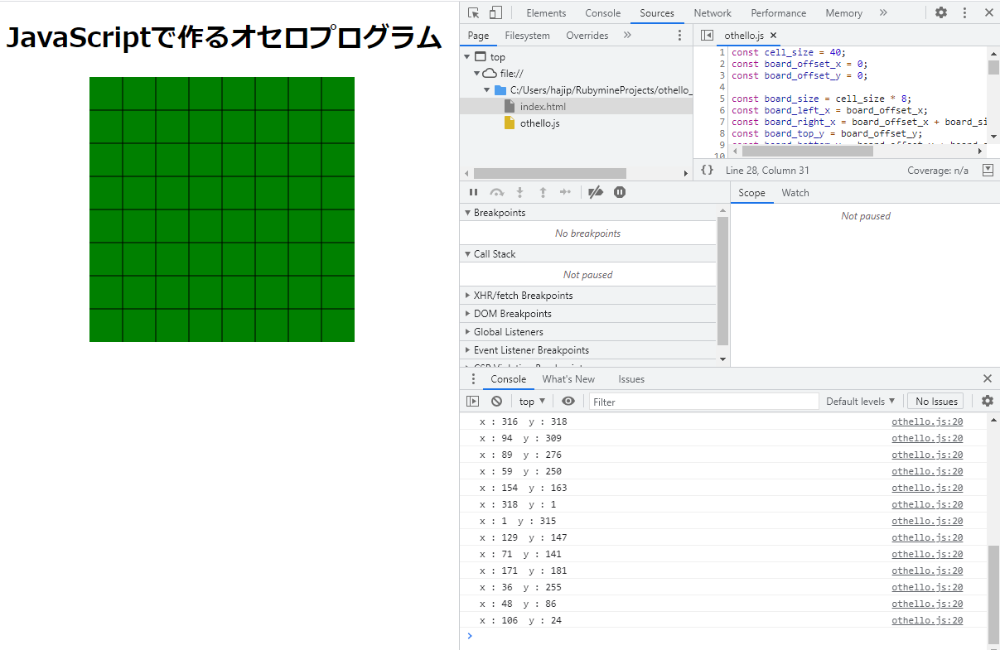

# 2-1. クリックで石を置こう　クリックイベント

前回までで一通り描画処理ができました。
MVCモデルでいうところのViewですね。

そして今回からはクリックに反応して動作するアプリっぽいものに入っていきます。

## クリックイベント

最初は難しそうに思うかもしれませんが、なかなかシンプルなコードでイベントを受け取ることができます。
`window.onload`の処理の中に↓を書いてみましょう。これだけで盤をクリックしたときにアラートダイアログができるようになります。


```
    document.querySelector('svg#board').onclick = function() {
        alert('hoge');
    }
```

### コールバックメソッド

上記のように、要素の`onclick`プロパティに対して`function() {～～～}`と、メソッドを丸々代入するような書き方をコールバックメソッドとかコールバック関数と言います。

これは、この要素（ここではSVGタグ）をクリックしたというイベントをキャッチしたときに、実行したいメソッドを登録してるということになります。

そのため、`onload`の中に書いてあってもページが表示されたタイミングではメソッドの中身は実行されず、あくまでイベントをキャッチしたときにしか実行されません。

ここまで読んでお気づきかと思いますが、`window.onload`に代入してるのもコールバックメソッドで、このページが表示された時のイベントをキャッチしてメソッドが実行されます。

メソッドを登録すればいいだけなので、↓のような書き方もできます。ここで間違えて`= fuga();`としてしまうと、メソッドを登録ではなく、メソッドの戻り値を登録になってしまうため、fugaは即時実行されてしまいます。

```
window.onload = function() {
    draw_board();
    board_element().onclick = fuga;
};

function fuga() {
    alert('hoge');
}
```
### クリック座標取得

上記は`onclick`でイベントをキャッチしてみましたが、クリックした座標が欲しい場合は`addEventListener`を使ったりします。書き方は少し変わりますがコールバックメソッドであることは変わりません。

コールバックメソッドの引数に指定した e の中にいろいろ情報が入ってます。今回取りたいのは要素の中での座標です。

↓は盤をクリックしたら盤の中での座標をログに表示するようにしました。ログはブラウザの「その他ツール」→「デベロッパーツール」→上部タブの「Console」を表示してみましょう

※Chromeの場合の名前で、各種ブラウザで同じ機能があります。これらの開発用ツールは非常に便利ですので積極的に使ってみてください。
```
    board_element().addEventListener('click', function(e){
        console.log('x : ' + e.offsetX + '  y : ' + e.offsetY);
    });
```
- - -


- - -
## 画面座標をマス座標に変換する

STEP1-3で描画のために変換したやつの逆バージョンが要りますね。
しかし今回も注意する点があります。割り算が入るときは小数点の扱いを考える必要があります。

今回はマス座標にするので整数しか受け付けられません。左上のマスで考えると、0～39を0、40～79を1とすれば良さそうですので、小数点切り捨ての関数を使います。

まだ使ってませんが盤のoffsetも忘れずに。
```
// 画面座標からマス座標に変換します。
// view_point = { x : int, y : int }
// return { x : 0..7, y : 0..7 }
function parse_cell_point(view_point) {
    return {
        x : Math.floor((view_point.x - board_offset_x) / cell_size),
        y : Math.floor((view_point.y - board_offset_y) / cell_size)
    }
}
```

書いたコードをテストしてみましょう。思った通りのマスで思った通りの座標が出力されているか確認してみてください。
```
window.onload = function() {
    draw_board();
    board_element().addEventListener('click', function(e){
        console.log('x : ' + e.offsetX + '  y : ' + e.offsetY);
        let cell_point = parse_cell_point({ x : e.offsetX, y : e.offsetY });
        console.log('cell_x : ' + cell_point.x + '  cell_y : ' + cell_point.y);
    });
};
```
- - -
前回とのコード差分

https://github.com/hajipong/othello_programme_study/compare/step1_3...step2_1
- - -

[＜前](https://github.com/hajipong/othello_programme_study/tree/step1_3)　
[次＞](https://github.com/hajipong/othello_programme_study/tree/step2_2)
