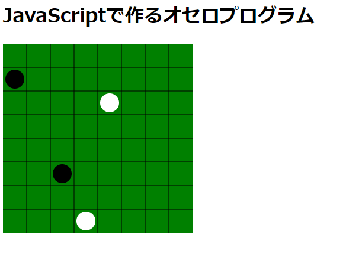

# 1-3. 画面を作ろう　石を描画しよう

オセロ石は固定的ではないため、描画処理を書くには作戦が要ります。

* 石1個を描くのにどんな情報が要るか？
* 盤上の石全部を表すにはどんなデータにしたいか？

という、データの受け渡しに関する部分を設計していきます。

※途中コメントについて触れていますが、JSDocに準じるのはこの記事ではやりません。

## 石1個の描画情報

SVGのcircleを使って石を表現するには、中心点の座標、直径、色があればできそうです。
では受け取りはその3つにしたらよいか？いいえ、もっと整理しないといけません。

### 中心点の座標

SVGにおいての座標は、あくまで描画する地点を表します。そしてこれはcircleタグを実際書く段階で最終的に決まればいいものなので、この座標を外から受け取る時点ではまだ無くてよいです。

そうすると必要なのは「どこのセルか？」がわかる物であればよいですね。今回はセルを表すのに{x:0, y:0}といった連想配列で表現してみましょう。

ここで盤面的な座標を受け取り、描画領域の座標を求めるお仕事が発生したので、専用メソッドを作ります。

コメントに引数のデータがどんな物か例を書いておくのもミソですね。特に0～7って書いてるのも勘違いを防ぎます。1～8で書いてる部分があったとして混同しにくくなります。

戻り値がある物なのでその構造もコメントに書くとよいでしょう。
```
// マス座標を石描画座標に変換します。
// cell_point = { x : 0..7, y : 0..7 }
// return { x : int, y : int }
function parse_stone_view_point(cell_point) {
    let cell_offset = cell_size / 2;
    return {
        x : board_offset_x + cell_point.x * cell_size + cell_offset,
        y : board_offset_x + cell_point.y * cell_size + cell_offset,
    }
}
```

### 直径

これは固定でいいはずのものです。但しSTEP1-2でやったように固定的な数字は定数にしていくのと、適切な名前の定義にしておくべきですね。

```
const stone_radius = (cell_size / 2) * (8 / 10); // マスの80%
```
### 色

オセロの石なので黒か白の情報があればいいです。が、ここで注意です。またまたSTEP1-2で出てきた話です。

色番号としての黒#000と白#FFFは、オセロとしての黒と白とでは、結果的に同じものですが意味的には別物です。

この程度ならわざわざ表現しなくてもよいのですが、練習なので連想配列にてあるべき構造で表現してみましょう。
石としての黒と白があり、それぞれの構成情報として色番号を持っている　という構造ができました。
```
const STONE = {
  BLACK : { color : '#000' },
  WHITE : { color : '#FFF' }
};
```

### 描画

以上を踏まえて描画メソッドはpointの連想配列とstoneの連想配列を、↓のコメントのような範囲で受け取り、
中で座標変換を呼び出しつつ、タグを作る感じになりました。

onloadでこのようにメソッドを呼び出してみると、見事石が描画されました。
```
window.onload = function() {
    draw_board();
    draw_stone({x:2, y:5}, STONE.BLACK);
    draw_stone({x:4, y:2}, STONE.WHITE);
    draw_stone({x:0, y:1}, STONE.BLACK);
    draw_stone({x:3, y:7}, STONE.WHITE);
};

// 石を描画します。
// cell_point = { x : 0..7, y : 0..7 }
// stone = STONE.BLACK or STONE.WHITE
function draw_stone(cell_point, stone) {
    let view_point = parse_stone_view_point(cell_point);
    let circle = document.createElementNS('http://www.w3.org/2000/svg', 'circle');
    circle.setAttribute('cx', view_point.x);
    circle.setAttribute('cy', view_point.y);
    circle.setAttribute('r', stone_radius);
    circle.setAttribute('fill', stone.color);
    board_element().appendChild(circle);
}
```
- - -

- - -
## 石1個の描画情報

今度は石全部を表す方法を考えます。が、こちらは結局配列があれば良いだけですから、
単純にマス座標と石の連想配列を石1個の配置情報として、それらの配列を用意するだけで良さそうです。

```
    let put_stones = [
        { cell_point : { x : 2, y : 5 }, stone : STONE.BLACK },
        { cell_point : { x : 4, y : 2 }, stone : STONE.WHITE },
        { cell_point : { x : 0, y : 1 }, stone : STONE.BLACK },
        { cell_point : { x : 3, y : 7 }, stone : STONE.WHITE },
    ];
    for (let put_stone of put_stones) {
        draw_stone(put_stone.cell_point, put_stone.stone);
    }
```

- - -
前回とのコード差分

https://github.com/hajipong/othello_programme_study/compare/step1_2...step1_3
- - -

[＜前](https://github.com/hajipong/othello_programme_study/tree/step1_2)　
[次＞](https://github.com/hajipong/othello_programme_study/tree/step2_1)
