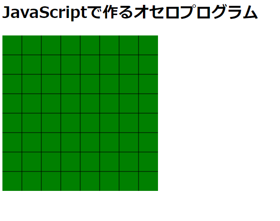

# 1-1. 画面を作ろう　SVGで盤を描画

最近ではSVGタグを使えばHTMLでも簡単に図が描けます。

まずは盤部分をとりあえず書くとこうなります。

- - -

- - -
SVGについては少し記事を書いてますので、こちらをご覧ください。

https://ameblo.jp/hajipong/entry-12697337004.html
- - -
前回とのコード差分

https://github.com/hajipong/othello_programme_study/compare/step0...step1
- - -

[＜前](https://github.com/hajipong/othello_programme_study/tree/step0)　
[次＞](https://github.com/hajipong/othello_programme_study/tree/step1_2)